### Flutter UI clones

1. Login UI
(Credits : [Karthick Krishnamoorthy](https://dribbble.com/shots/6969883--001-Sign-up-form-DailyUI-challenge))

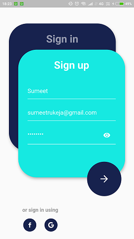

2. Toy cart UI
(Credits : [Serhii Polyvanyi](https://dribbble.com/shots/6975747-Mobile-App-for-Toy-Store-Inner-screens))

3. Balloon slider
(Credits : [Cuberto](https://dribbble.com/shots/6549207-Balloon-Slider-Control))

4. Onboarding UI
(Credits : [Cuberto](https://dribbble.com/shots/6654320-Animated-Onboarding-Screens))

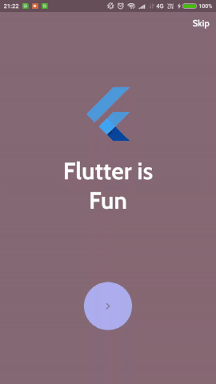

5. Rating UI
(Credits : [Cuberto](https://dribbble.com/shots/7060121-Rate-your-ride-animated-SWIFT))

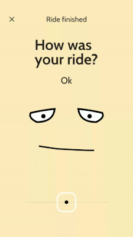

6. Performance Graph
(Credits : [Selecto](https://dribbble.com/shots/7112902-Soccer-player-profile))

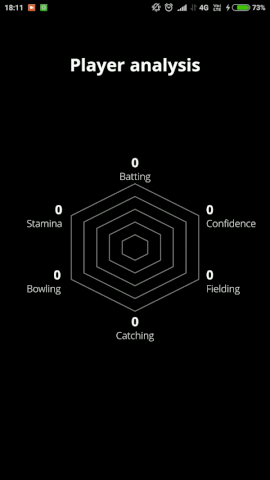

7. Menu interaction concept
(Credits : [Oleg Frolov](https://dribbble.com/shots/7197834-Menu-Interaction-Concept))

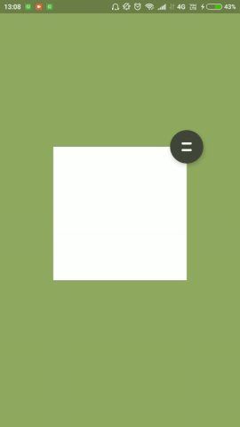

8. Swipe to respond
(Credits : [Cuberto](https://dribbble.com/shots/5961284-Gooey-Cell-Open-Source))

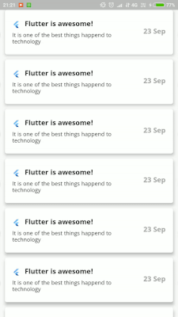

9. Gooey Tab Bar
(Credits : [Cuberto](https://dribbble.com/shots/6233130-Gooey-Tab-Bar))

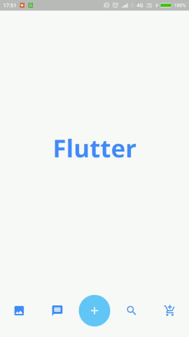

10. Send Message
(Credits : [Sreeraj VS](https://dribbble.com/shots/7274417-Message-Sent-Successfully-Micro-interaction))

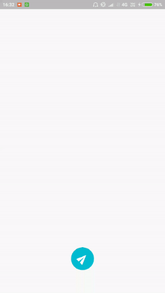

11. Tab Menu
(Credits : [Cuberto](https://dribbble.com/shots/6482411-Alternative-Facebook-Menu))

12. Progress Indicator
(Credits : [Cuberto](https://dribbble.com/shots/6441572-Water-electrolyte-Imbalance-App))

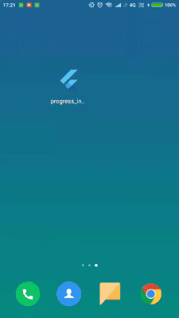

13. Tab change animation
(Credits : [Dimest](https://dribbble.com/shots/4201234-Tab-bar-icons))

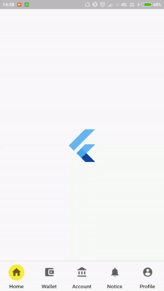

14. Tab change animation 2
(Credits : [Cuberto](https://dribbble.com/shots/5660844-Flashy-Tab-Bar-Open-Source))

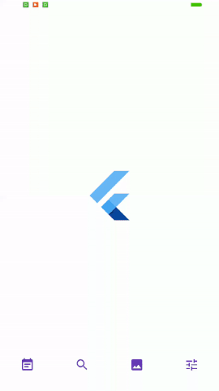

15. Progress loaders
(Credits : [Gilbert BG](https://dribbble.com/shots/6255364-X-Loader-Animation))
(Credits : [Anas M. ElGendy](https://dribbble.com/shots/6122776-Crazy-Frog-Loading))

